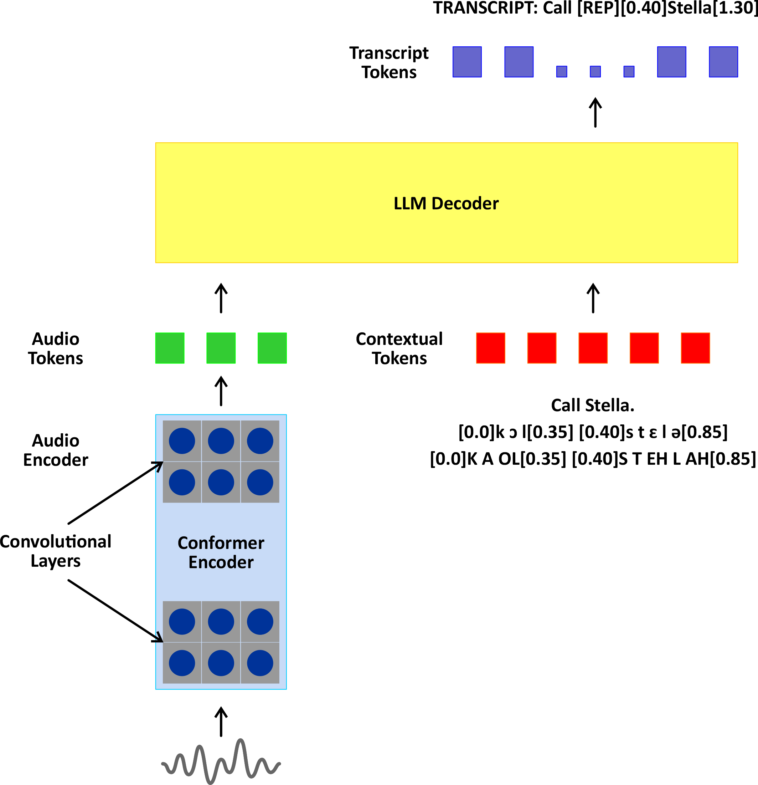

# Smooth Operators: LLMs Translating Imperfect Hints into Disfluency-Rich
Transcripts 

This repository contaons coder for the INTERSPEECH2025 paper [Smooth Operators: LLMs Translating Imperfect Hints into Disfluency-Rich Transcripts](). 

## Overview

Our work presents a novel approach to detecting and transcribing disfluencies in spoken language using large language models (LLMs). By integrating acoustic representations with textual inputs—even if imperfect—we generate fully annotated transcripts with precise disfluency tokens and timestamps, advancing speech and language processing capabilities.

</img>

